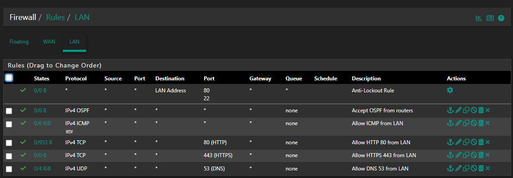
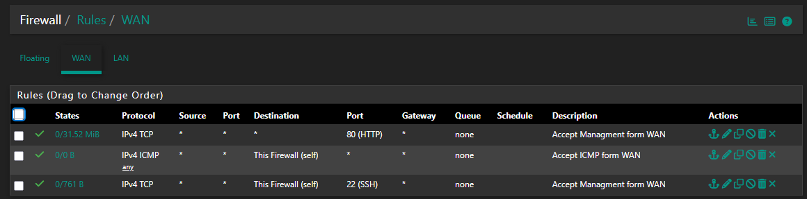

# Konfiguracja Firewall

## Założenia

| FROM \\ TO | ADM (V10) | USERS (V20) | DMZ (V40) | KALI (V50) | INTERNET (V30) |
| --- | --- | --- | --- | --- | --- |
| **ADM (V10)** | —   | ✔   | ✔   | ✖   | ✔**   |
| **USERS (V20)** | ✖   | —   | ✔\* | ✖   | ✔**   |
| **DMZ (V40)** | ✖   | ✖   | —   | ✖   |	✖   |
| **KALI (V50)** | ✖   | ✖   | ✖   | —   | ✖   |
| **INTERNET (V30)** | ✖   | ✖   | ✖   | ✖   | —   |
---
## Objaśnienia
#### ADM (V10)
- Ma dostęp do stref wewnętrznych USERS, DMZ
- Dostęp do INTERNETU jest dozwolony HTTP, HTTPS oraz DNS – TCP/UDP 53
- Jest to strefa administracyjna, dlatego posiada pełne uprawnienia zarządzające.

#### USERS (V20)
- Może komunikować się z DMZ, ale tylko w ograniczonym zakresie.
	- Dozwolone są:
		-  ICMP (ping) do hosta 192.168.40.10,
		- TCP port 80 oraz 443 do hosta 192.168.40.10.
- Cały pozostały ruch do DMZ jest zablokowany.
- Dostęp do INTERNETU jest dozwolony HTTP, HTTPS oraz DNS – TCP/UDP 53.
- Brak dostępu do ADM oraz KALI.

#### DMZ (V40)
- Nie ma dostępu do ADM, USERS, KALI1 oraz internetu.
- Dostęp do sieci DMZ mają sieci USERS  (ograniczony) i ADM (pełny)

#### KALI (V50)
- Nie posiada dostępu do żadnej strefy wewnętrznej oraz internetu.

#### INTERNET (V30)
- Nie ma dostępu do żadnej z pozostałych stref sieciowych.
- Pełni rolę strefy zewnętrznej, izolowanej od sieci wewnętrznej.

---

## Konfiguracja urządzeń

### R1 & R3
``` cmd
ip access-list extended ACL_ADM
 remark =================================================
 remark ====== ADM (192.168.10.0/24) ======
 permit ip 192.168.10.0 0.0.0.255 any
 remark ============= ICMP ADM <-> PC (ping) ============
 permit icmp 192.168.10.0 0.0.0.255 192.168.20.0 0.0.0.255 echo
 permit icmp 192.168.20.0 0.0.0.255 192.168.10.0 0.0.0.255 echo-reply
 remark =================================================

interface GigabitEthernet6/0.10
 ip access-group ACL_ADM in

 ip access-list extended ACL_PC
 remark ============= ICMP ADM <-> PC (ping) ============
 permit icmp 192.168.10.0 0.0.0.255 192.168.20.0 0.0.0.255 echo
 permit icmp 192.168.20.0 0.0.0.255 192.168.10.0 0.0.0.255 echo-reply
 remark =================================================
 remark === PC (192.168.20.0/24) ===
 permit tcp 192.168.20.0 0.0.0.255 192.168.30.0 0.0.0.255 eq www
 permit tcp 192.168.20.0 0.0.0.255 192.168.30.0 0.0.0.255 eq 443
 permit tcp 192.168.20.0 0.0.0.255 192.168.40.0 0.0.0.255 eq www
 permit tcp 192.168.20.0 0.0.0.255 192.168.40.0 0.0.0.255 eq 443
 permit tcp any 192.168.20.0 0.0.0.255 established
 permit udp 192.168.20.0 0.0.0.255 any eq 53
 permit udp any 192.168.20.0 0.0.0.255 eq 53
 deny tcp 192.168.20.0 0.0.0.255 192.168.40.0 0.0.0.255 eq 22
 deny   ip 192.168.20.0 0.0.0.255 192.168.10.0 0.0.0.255
 deny   ip 192.168.20.0 0.0.0.255 192.168.50.0 0.0.0.255
 permit ip 192.168.20.0 0.0.0.255 any
 remark =================================================

interface GigabitEthernet6/0.20
 ip access-group ACL_PC in
```

### R2 & R5
``` cmd
ip access-list extended ACL_DMZ
 remark === DMZ (192.168.40.0/24) ===
 permit tcp 192.168.40.0 0.0.0.255 any established
 permit icmp 192.168.40.0 0.0.0.255 192.168.10.0 0.0.0.255 echo-reply
 permit icmp 192.168.40.0 0.0.0.255 192.168.20.0 0.0.0.255 echo-reply
 remark --- BLOKADA INICJACJI DMZ -> ADM ---
 deny tcp 192.168.40.0 0.0.0.255 192.168.10.0 0.0.0.255 eq 22
 deny tcp 192.168.40.0 0.0.0.255 192.168.10.0 0.0.0.255 eq 80
 deny tcp 192.168.40.0 0.0.0.255 192.168.10.0 0.0.0.255 eq 443
 deny udp 192.168.40.0 0.0.0.255 192.168.10.0 0.0.0.255 eq 53

 remark --- BLOKADA INICJACJI DMZ -> PC ---
 deny tcp 192.168.40.0 0.0.0.255 192.168.20.0 0.0.0.255 eq 22
 deny tcp 192.168.40.0 0.0.0.255 192.168.20.0 0.0.0.255 eq 80
 deny tcp 192.168.40.0 0.0.0.255 192.168.20.0 0.0.0.255 eq 443
 deny udp 192.168.40.0 0.0.0.255 192.168.20.0 0.0.0.255 eq 53
 remark =================================================

interface GigabitEthernet6/0.40
 ip access-group ACL_DMZ in

 ip access-list extended ACL_KALI
 remark === KALI (192.168.50.0/24) ===
 permit ip 192.168.50.0 0.0.0.255 192.168.30.0 0.0.0.255
 deny   ip 192.168.50.0 0.0.0.255 any
 remark =================================================

interface GigabitEthernet6/0.50
 ip access-group ACL_KALI in
```

### PfSense

#### Konfiguracja LAN


#### Konfiguracja WAN

