# Scenariusze i walidacje

## 1. Wykrycie urządzeń sieciowych
**Narzędzie:** `nmap`, `arp-scan`  
**Cel:** Identyfikacja hostów w VLAN-ach.  

**Komenda przykładowa:**
```bash
nmap -sn 192.168.20.0/24
arp-scan --interface=eth0 192.168.20.0/24
```

**Wyniki:**

### KALI 1  
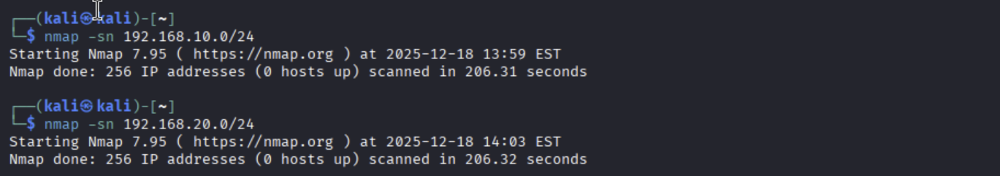  
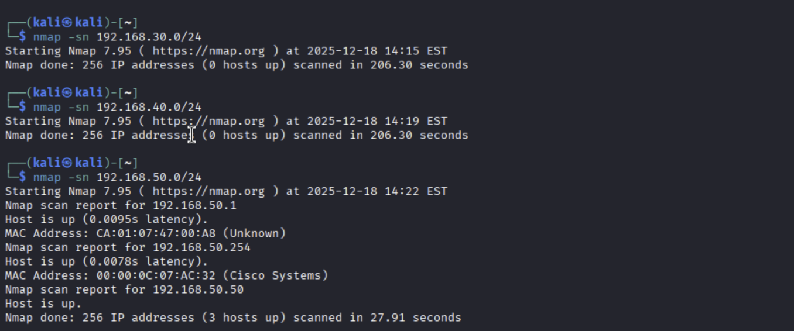  

### KALI 2  
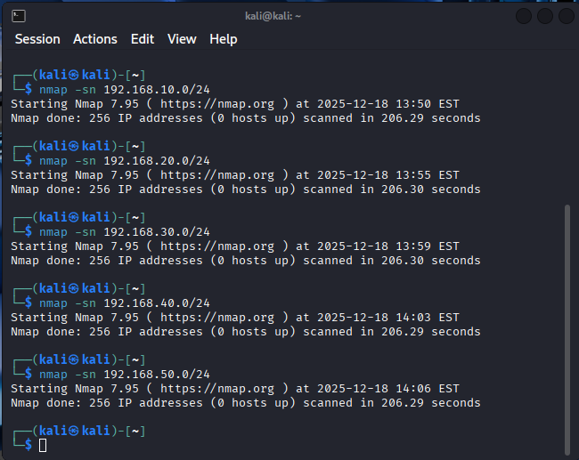  
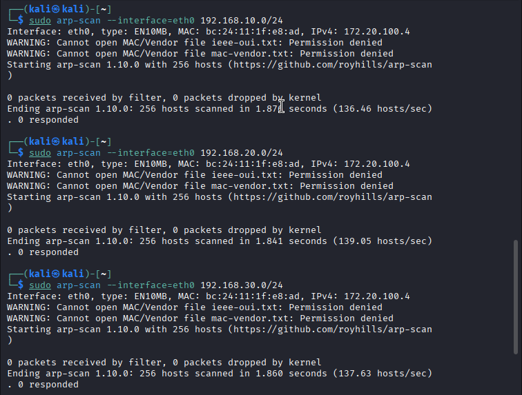  

---

## 2. Wykrycie uruchomionych usług sieciowych
**Narzędzie:** `nmap`  
**Cel:** Wykrycie usług na serwerach DMZ.  

**Komenda:**
```bash
nmap -sV 192.168.40.10
```

**Wyniki:**

### KALI 1  
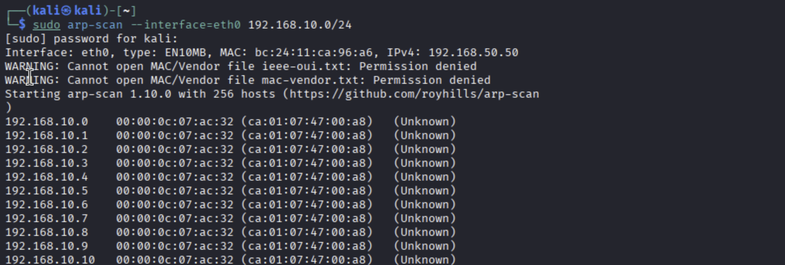  
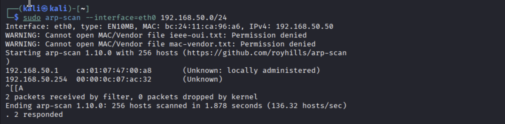  

### KALI 2  
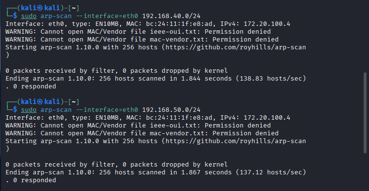  

---

## 3. Atak man-in-the-middle – ARP spoofing
**Narzędzie:** `arpspoof`, `ettercap`  
**Cel:** Przechwycenie ruchu między hostem a bramą.  

**Komenda:**
```bash
arpspoof -i eth0 -t 192.168.20.10 192.168.20.254
```

**Wyniki:**

### KALI 1  
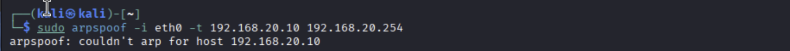  

### KALI 2  
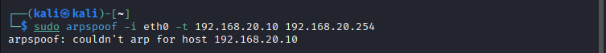  

---

## 4. Atak man-in-the-middle – Ping flood
**Narzędzie:** `hping3`  
**Cel:** Zalanie hosta pakietami ICMP.  

**Komenda:**
```bash
hping3 --icmp --flood 192.168.20.10
```

**Wyniki:**

### KALI 1  
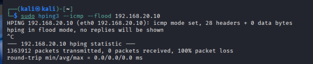  

### KALI 2  
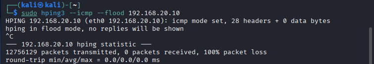  

---

## 5. Atak odmowy usługi (DoS) – TCP SYN Flood
**Narzędzie:** `hping3`  
**Cel:** Wywołanie przeciążenia serwera.  

**Komenda:**
```bash
hping3 -S --flood -p 80 192.168.40.10
```

**Wyniki:**

### KALI 1  
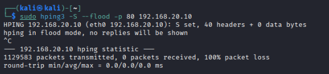  

### KALI 2  
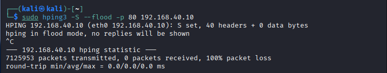  

---

## 6. Atak typu „Ping of Death”
**Narzędzie:** `ping`  
**Cel:** Wysyłanie nadmiarowych pakietów ICMP.  

**Komenda:**
```bash
ping -s 65500 192.168.20.10
```

**Wyniki:**

### KALI 1  
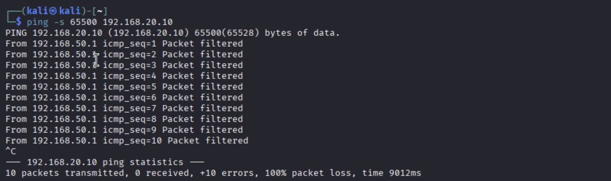  

### KALI 2  
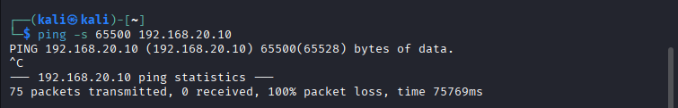  

---

## 7. Wykrywanie podatności serwera przy użyciu Nessus
**Narzędzie:** `Nessus`  
**Cel:** Skanowanie podatności serwera DMZ.  
- Dodaj cel: `192.168.40.10`.
- Wykonaj pełny skan podatności.

---

# Wnioski

### Kali 1 (strona LAN pfSense)

- Kali 1 miał możliwość wykrywania aktywnych hostów w tej samej sieci lokalnej, w szczególności przy użyciu ARP-scan.
- Ataki warstwy 2 (ARP spoofing) były możliwe tylko w obrębie lokalnego segmentu, jednak nie zadziałały z powodu izolacji lub braku wspólnej domeny rozgłoszeniowej.
- Ruch ICMP i próby floodowania były filtrowane, co zapobiegło skutecznemu przeciążeniu hostów.
- Próby ataków DoS (SYN flood, ping flood) nie spowodowały degradacji usług w sieci LAN.
- Wniosek ogólny (LAN):
  Przedstawiona konfiguracja chroni sieć lokalną przed atakami rozpoznawczymi i przeciążeniowymi, zapewniając wysoki poziom izolacji i bezpieczeństwa.

### Kali 2 (strona WAN pfSense)

- Kali 2 nie miał możliwości wykrycia hostów wewnętrznych przy użyciu skanów ICMP i ARP.
- ARP-scan oraz ataki MITM były całkowicie nieskuteczne z uwagi na brak dostępu do warstwy 2.
- Ruch ICMP oraz pakiety SYN były blokowane lub filtrowane na interfejsie WAN pfSense.
- Próby ataków typu DoS i Ping of Death nie miały wpływu na dostępność systemów po stronie LAN.
- Wniosek ogólny (WAN):
	pfSense skutecznie izoluje sieć wewnętrzną od strony WAN, uniemożliwiając zarówno rozpoznanie infrastruktury, jak i przeprowadzenie podstawowych ataków sieciowych.
